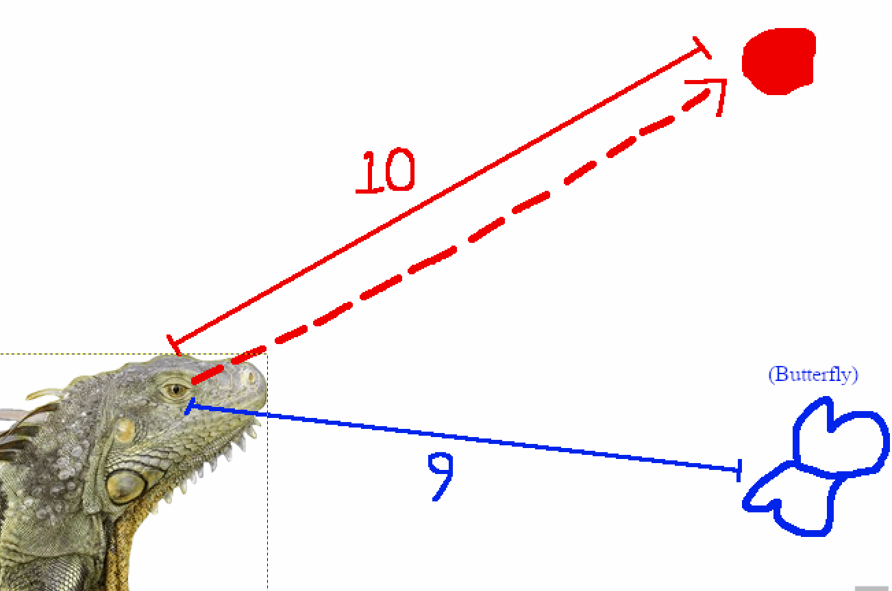
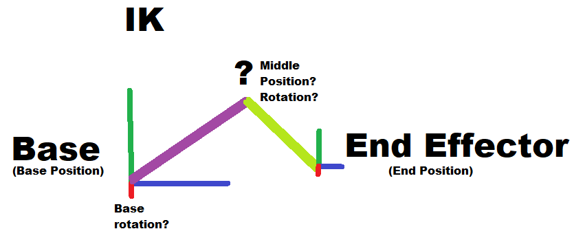
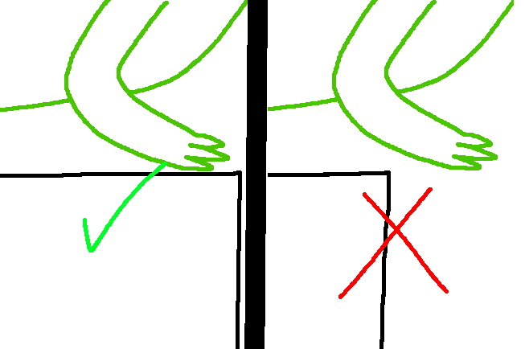
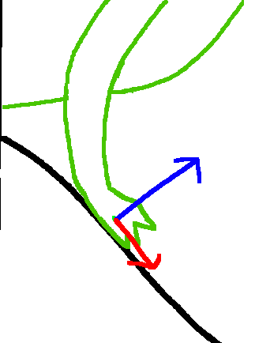

# GPR-450 Final Project

## Using IK for Complex Interactive Creature Animation

### Rory Beebout, Jonathan DeLeon

---

### Description

This demo is an excercise in using IK to bring a lizard model to life.

---
### Main Features:
- **Look-at**
- 
- 
- **Stepping**
- 
- 
- 
-  
- **Tail Physics**
- 
---

### Instructions

Open in Unity, WASD to move.

---
